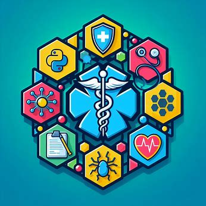

# CareChain

  

CareChain è un software che facilita la gestione e la condivisione dei dati tra pazienti, medici e operatori sanitari utilizzando la tecnologia blockchain. È progettato per fornire una base solida sulla quale gli utenti possono sviluppare il proprio operato e condividere informazioni sensibili in modo sicuro e trasparente.

## Funzionalità

- **Gestione dei dati**: Consentire agli utenti di archiviare e accedere ai propri dati medici in modo sicuro e affidabile.
- **Condivisione sicura**: Fornire un meccanismo per la condivisione selettiva dei dati tra pazienti, medici e operatori sanitari.
- **Trasparenza**: Utilizzare la blockchain per garantire la tracciabilità e l'immuatabilità delle transazioni di dati.
- **Interfaccia utente intuitiva**: Offrire un'esperienza utente semplice e intuitiva per facilitare l'utilizzo del software.

## Tecnologie utilizzate

- **Blockchain**: Utilizziamo la blockchain Ganache per garantire la sicurezza e l'integrità dei dati.
- **Python**: Il backend del software è sviluppato in Python per la sua flessibilità e facilità di sviluppo.
- **Interfaccia a linea di comando (CLI)**: Attualmente supportiamo un'interfaccia a linea di comando per l'interazione con il software.

## Installazione

Per installare e utilizzare CareChain, segui questi passaggi:

1. Clona il repository sul tuo computer:

